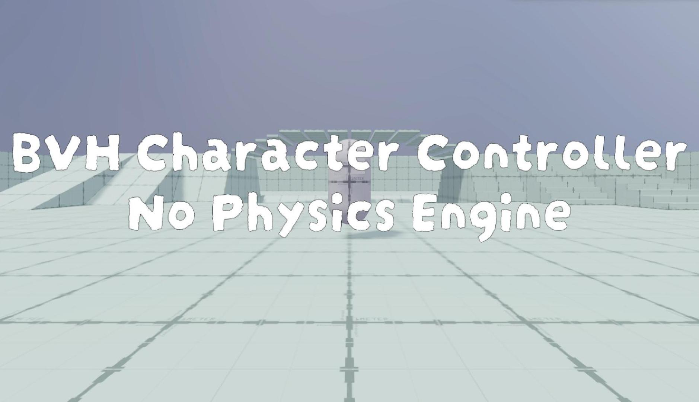
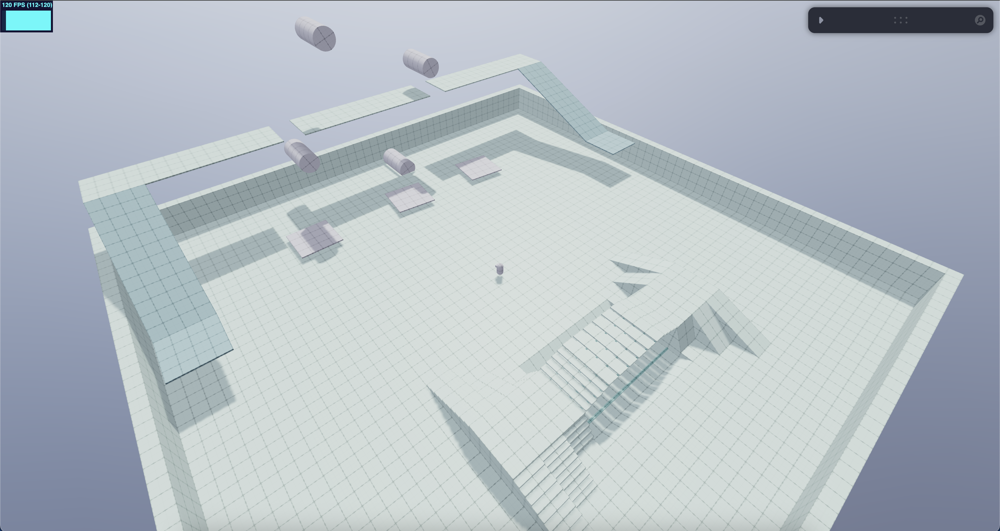
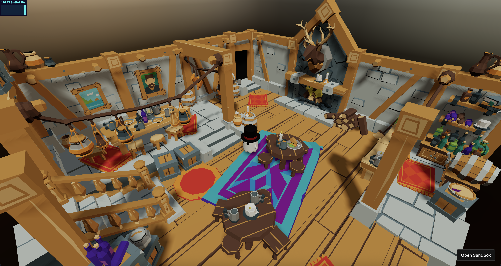

# 🕹️ BVHEcctrl

[](https://bvhecctrl.vercel.app/)

[**BVHEcctrl**](https://github.com/pmndrs/bvhecctrl) is a lightweight, plug-and-play character controller designed for [`react-three-fiber`](https://github.com/pmndrs/react-three-fiber). It requires **no physics engine**, and utilizes [`three-mesh-bvh`](https://github.com/gkjohnson/three-mesh-bvh) for highly efficient, triangle-accurate collision detection and response.

> 🧠 Ideal for web-based 3D experiences such as games, interactive portfolios, and virtual worlds.

---

## 📸 Examples

<p>
  <a href="https://bvhecctrl.vercel.app/" target="_blank">
    
  </a>
  <a href="https://codesandbox.io/p/sandbox/xkk3nf?file=%2Fsrc%2FApp.tsx%3A44%2C1" target="_blank">
    
  </a>
</p>

---

## ✨ Features

- No physics engine required
- Fast BVH-based collision detection
- Smooth floating capsule movement for stairs, slopes, and uneven surfaces
- Built-in support for:
  - `StaticCollider`
  - `KinematicCollider`
  - `InstancedStaticCollider`

---

## 📦 Installation

```bash
npm install bvhecctrl
```

## ⚙️ How to Use

### Step 1: Setup Keyboard Controls and Character Controller

```js
import BVHEcctrl from "bvhecctrl";
import { KeyboardControls } from "@react-three/drei";

const keyboardMap = [
  { name: "forward", keys: ["ArrowUp", "KeyW"] },
  { name: "backward", keys: ["ArrowDown", "KeyS"] },
  { name: "leftward", keys: ["ArrowLeft", "KeyA"] },
  { name: "rightward", keys: ["ArrowRight", "KeyD"] },
  { name: "jump", keys: ["Space"] },
  { name: "run", keys: ["Shift"] },
];

return (
  <KeyboardControls map={keyboardMap}>
    <BVHEcctrl ref={ecctrlRef}>
      <CharacterModel />
    </BVHEcctrl>
  </KeyboardControls>
);
```

### Step 2: Add Colliders to Your Map

```js
import {
  StaticCollider,
  KinematicCollider,
  InstancedStaticCollider,
} from "bvhecctrl";

useFrame((_, delta) => {
  if (kinematicRef.current) kinematicRef.current.rotation.y += delta;
});

return (
  <>
    <StaticCollider>
      <MapModel />
    </StaticCollider>

    <KinematicCollider ref={kinematicRef}>
      <MapModel />
    </KinematicCollider>

    <InstancedStaticCollider>
      <InstancedMapModel />
    </InstancedStaticCollider>
  </>
);
```

### Step 3: Handle Camera Movement

You can use any camera control system that fits your needs — such as `<OrbitControls>`, `<PointerLockControls>`, `<CameraControls>`, or your own custom setup.
For smooth and flexible control, I highly recommend using [`<CameraControls>`](https://github.com/yomotsu/camera-controls) from [`@react-three/drei`](https://github.com/pmndrs/drei). It even offers built-in camera collision support.

Here’s a simple example using `<CameraControls>` to follow the character:

```js
useFrame(() => {
  camControlRef.current.moveTo(
    ecctrlRef.current.group.position.x,
    ecctrlRef.current.group.position.y + 0.3,
    ecctrlRef.current.group.position.z,
    true
  );
});
```

## 🧱 BVHEcctrl Props

| Prop                         | Type                               | Default            | Description                                                   |
| ---------------------------- | ---------------------------------- | ------------------ | ------------------------------------------------------------- |
| `debug`                      | `boolean`                          | `false`            | Enables visual debugging.                                     |
| `colliderCapsuleArgs`        | `[number, number, number, number]` | `[0.3, 0.6, 4, 8]` | Capsule shape: [radius, height, capSegments, radialSegments]. |
| `paused`                     | `boolean`                          | `false`            | Freezes character physics and collision response.             |
| `delay`                      | `number`                           | `1.5`              | Physics delay after initialization (in seconds).              |
| `gravity`                    | `number`                           | `9.81`             | World gravity.                                                |
| `fallGravityFactor`          | `number`                           | `4`                | Multiplier to increase falling speed.                         |
| `maxFallSpeed`               | `number`                           | `50`               | Maximum fall velocity cap.                                    |
| `mass`                       | `number`                           | `1`                | Virtual mass, affects float behavior.                         |
| `sleepTimeout`               | `number`                           | `10`               | Time before character enters sleep state when idle.           |
| `slowMotionFactor`           | `number`                           | `1`                | Global time scaling (e.g., `0.5` = half-speed).               |
| `turnSpeed`                  | `number`                           | `15`               | Turn speed when changing direction.                           |
| `maxWalkSpeed`               | `number`                           | `3`                | Max speed when walking.                                       |
| `maxRunSpeed`                | `number`                           | `5`                | Max speed when running.                                       |
| `acceleration`               | `number`                           | `26`               | Speed increase per second.                                    |
| `deceleration`               | `number`                           | `15`               | Speed decrease when input is released.                        |
| `counterVelFactor`           | `number`                           | `1.5`              | Extra velocity when changing direction.                       |
| `airDragFactor`              | `number`                           | `0.3`              | Simulated drag while in air.                                  |
| `jumpVel`                    | `number`                           | `5`                | Upward velocity when jumping.                                 |
| `maxSlope`                   | `number`                           | `1`                | Max walkable surface slope (in radians).                      |
| `floatHeight`                | `number`                           | `0.2`              | Desired float height above ground.                            |
| `floatPullBackHeight`        | `number`                           | `0.25`             | Additional distance below ground used to pull character down. |
| `floatSensorRadius`          | `number`                           | `0.12`             | Radius of the sensor used to sense the ground.                |
| `floatSpringK`               | `number`                           | `600`              | Spring constant for floating.                                 |
| `floatDampingC`              | `number`                           | `28`               | Damping factor for float spring (prevents oscillation).       |
| `collisionCheckIteration`    | `number`                           | `3`                | Number of collision check per frame.                          |
| `collisionPushBackVelocity`  | `number`                           | `3`                | Extra velocity applied to resolve penetration.                |
| `collisionPushBackDamping`   | `number`                           | `0.1`              | Damping applied to the pushback force.                        |
| `collisionPushBackThreshold` | `number`                           | `0.005`            | Minimum depth before pushback activates.                      |

## 🧱 Collider Component Props

| Prop                    | Type      | Default       | Description                                                  |
| ----------------------- | --------- | ------------- | ------------------------------------------------------------ |
| `debug`                 | `boolean` | `false`       | Shows BVH bounds for debugging.                              |
| `debugVisualizeDepth`   | `number`  | `10`          | Depth level of BVH to visualize (debug only).                |
| `restitution`           | `number`  | `0.05`        | Bounciness on impact.                                        |
| `friction`              | `number`  | `0.8`         | Surface friction against character movement.                 |
| `excludeFloatHit`       | `boolean` | `false`       | If true, this collider is ignored in float sensor checks.    |
| `excludeCollisionCheck` | `boolean` | `false`       | If true, this collider is excluded from collision detection. |
| `BVHOptions`            | `object`  | _(see below)_ | Configuration for building the internal BVH tree.            |

Default BVHOptions:

```js
{
  strategy: SAH,
  verbose: false,
  setBoundingBox: true,
  maxDepth: 40,
  maxLeafTris: 10,
  indirect: false
}
```

## 🧩 Extra Utilities

### Accessing the Controller Ref:

```js
// Access the character group (THREE.Group)
ecctrlRef.current.group;

// Reset current velocity to zero
ecctrlRef.current.resetLinVel();

// Set linear velocity directly
ecctrlRef.current.setLinVel(THREE.Vector3);

// Set character movement, can have one or more inputs
ecctrlRef.current.setMovement({
  forward: boolean,
  backward: boolean,
  leftward: boolean,
  rightward: boolean,
  joystick: { x: number; y: number },
  run: boolean,
  jump: boolean,
});
```

### Read-only Character Status:

```js
import { characterStatus } from "bvhecctrl";

characterStatus.position; // THREE.Vector3
characterStatus.linvel; // THREE.Vector3
characterStatus.quaternion; // THREE.Quaternion
characterStatus.inputDir; // THREE.Vector3
characterStatus.movingDir; // THREE.Vector3
characterStatus.isOnGround; // boolean
characterStatus.isOnMovingPlatform; // boolean
characterStatus.animationStatus; // "IDLE" | "WALK" | "RUN" | "JUMP_START" | "JUMP_IDLE" | "JUMP_FALL" | "JUMP_LAND"
```

## 💰 Support This Project

If you find **BVHEcctrl** helpful, please consider [supporting the project](https://github.com/sponsors/ErdongChen-Andrew).

Your support means a lot and will help me dedicate more time to development, improvements, and documentation.

Every bit of support helps! Whether it’s a donation, a star, or simply sharing the project.
Thank you for helping me keep this project moving forward! 🙏

## 💡 What Add-ons Would You Like to See?

I’m considering offering additional features or paid extensions.  
If you're interested, feel free to vote or leave feedback:

- A vanilla three.js version of BVHEcctrl
- Custom gravity support (move on spheres)
- Tutorials on building this controller from scratch
- More experimental features and playground demos

💬 **Leave your thoughts on [GitHub](https://github.com/pmndrs/BVHEcctrl/issues) or join the discussion on the [pmndrs Discord](https://discord.com/channels/740090768164651008/1162488856088690879).**
